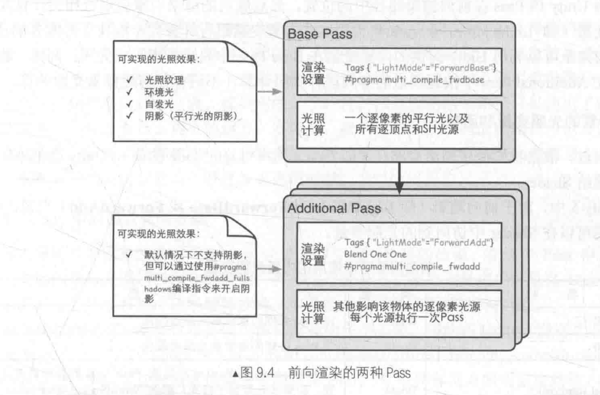

# 更复杂的光照

## 渲染路径

unity5.0以后, 只支持两种渲染路径

* 前向渲染路径
* 延迟渲染路径

大多数情况下一个项目只会使用一个渲染路径, 可以通过以下方式设置

**Edit** -> **Project Settings** -> **Player** -> **Other Settings** -> **Rendering Path**

如果我们希望不同的相机使用不同的路径, 可以在相机中单独设置

## 指定渲染路径

Tags 中的 `LightModel` 指定了渲染路径

| 标签名                             | 描述                                                         |
| ---------------------------------- | ------------------------------------------------------------ |
| `Always`                           | 不管使用哪种渲染路径,这个 Pass 一定会被渲染, 但是不计算光照  |
| `ForwardBase`                      | 用于**前向渲染**,这个 Pass 会计算环境光, 最重要的平行光, 逐顶点 SH 光源和 LightMaps |
| `ForwardAdd`                       | 用于**前向渲染**,这个 Pass 会计算额外的逐像素光源, 每个Pass对于一个光源 |
| `Drferred`                         | 用于**延迟渲染**,这个 Pass 会渲染到 G-Buffer 中              |
| `ShadowCaster`                     | 渲染到 ShadowMap 中                                          |
| `PrepassBase`                      | **遗留的延迟渲染**, 这个 Pass 会渲染法线和高光反射指数       |
| `PrepassFinal`                     | **遗留的延迟渲染**, 这个 Pass 会合并纹理, 光照和自发光得到最后的颜色 |
| `Vertex` `VertexLMRGBM` `VertexLM` | **用于遗留的顶点照明渲染**                                   |

## Unity 前向渲染

Unity 中有 3 种处理光照的方式:

* 逐顶点处理
* 逐像素处理
* 球谐处理

决定光源如何渲染, 是根据光源的类型和渲染模式. 渲染模式就是光源是否重要

Unity使用的判断规则如下:

* 场景中最亮的平行光总是逐像素处理
* 渲染模式被设置成 Not Important 光源, 会逐个顶点或者 SH 处理
* 渲染模式被设置成 Important 的光源会逐个像素处理
* 得到的逐像素光源小于 Quality Setting 中的逐个像素数量, 会更多的光源逐个像素处理



## 前向渲染中可以使用的内置光照变量

| 名称                                                         | 类型       | 描述                                                         |
| ------------------------------------------------------------ | ---------- | ------------------------------------------------------------ |
| `_LightColor0`                                               | `float4`   | 改 Pass 处理的逐像素光源的颜色                               |
| `_WorldSpaceLightPos0`                                       | `float4`   | 如果 `w != 0` 是点光源, 否则是方向光                         |
| `_LightMatrix0`                                              | `float4x4` | 光空间矩阵                                                   |
| `unity_4LightPosX0`,`unity_4LightPosY0`, `unity_4LightPosZ0` | `float4`   | 仅用于 `Base Pass` 中前四个 4 非重要的点光源在世界空间的位置 |
| `unity_4LightAtten0`                                         | `float4`   | 仅用于 `Base Pass` 存储了前 4 个非重要的点光源衰减因子       |
| `unity_LightColor`                                           | `half[4]`  | 仅用于 `Base Pass` 存储了前 4 个非重要的点光源的颜色         |

## 前向渲染中可以使用的内置光照函数

```cc
// 仅用于前向渲染中. 计算前四个点光源的光照, 它的参数是已经打包进矢量的光照数据. 分别是
float3 Shade4PointLights (
    float4 lightPosX, 
    float4 lightPosY, 
    float4 lightPosZ,
    float3 lightColor0, 
    float3 lightColor1, 
    float3 lightColor2, 
    float3 lightColor3,
    float4 lightAttenSq,
    float3 pos, 
    float3 normal
)
    
// 调用例子

```

## Unity 中的延迟渲染

当使用于延迟渲染; Unity 要求我们提供两个 Pass, 第一个用于渲染 G-Buffer, 第二个用来计算光照

默认的 G-Buffer 包含几个渲染纹理

1. RT0: 格式是 ARGB32, RGB存储漫反射, A通道没有使用
2. RT1: 格式是 ARGB32, RGB存储高光颜色, A通道存储高光的指数
3. RT2: 格式是 ARGB2101010, RGB存储法线, A没有被使用
4. RT3: 格式是 ARGB32, 用于存储 自反光 + lightMap 反射探针


### 完整的 Unity 多光源 ForwardAdd 例子

 [ForwardRedering.shader](ForwardRedering.shader) 


## Unity 中的阴影

Unity有一个额外的 Pass **"LightMode" = "ShadowCaster"** 来专门更新 ShadowMap 纹理. Unity 会在 Shader 中寻找, **ShadowCaster** 的 Pass, 如果没有找到, 它就会在 **Fallback** 指定的 UnityShader 中寻找.


虽然我们没有提供 **ShadowCaster** Pass, 但是我们的 Shader 也能够产生阴影, 这是因为我们提供了 **Fallback "Specalar"**, unity 找到内置着色器


默认情况情况下 Cast Shadows 会剔除物体的背面, 当设置为 Two Sided 后, 所有的面都会参与深度图的计算


Unity 提供了三个宏, 用来计算阴影

使用时需要包含以下两个头文件

```cc
#include "Lighting.cginc"
#include "AutoLight.cginc"
```


1. `SHADOW_COORDS(n)` 在插值结构体中使用

    ```cc
    struct VertexOut {
        float4 pos      : SV_POSITION;		// 要使用阴影宏时, 这个 SV_POSITION 只能命名为 pos
        float3 position : VOUT_POSITION;
        float3 normal   : VOUT_NORMAL;
        float2 texcoord : VOUT_TEXCOORD;
        SHADOW_COORDS(0);					// 这里的 n 会被展开为 : TEXCOORD##n
    }
    ```

2. 在顶点结构体中使用 `TRANSFER_SHADOW(o)`

    ```cc
    VertexOut vert(VertexIn vin) {
        VertexOut vout;
       	...
    	TRANSFER_SHADOW(vout);			// 这里做光空间的变换
        return vout;
    }
    ```

3. 片段着色器中获取衰减 `UNITY_LIGHT_ATTENUATION(var, input, worldPosition)`

    ```cc
    fixed4 frag(VertexOut pin) : SV_TARGET {
        ...
        UNITY_LIGHT_ATTENUATION(attenuation, pin, pin.position);
        return (diffuse + specular) * attenuation;
    }
    ```

    


