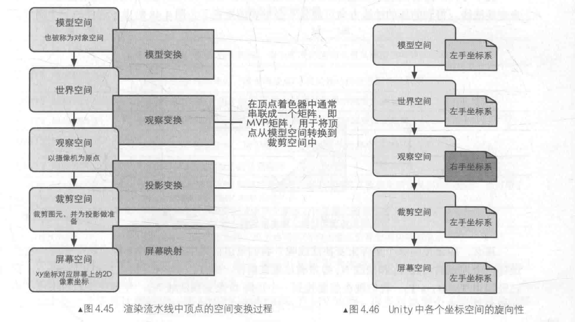

# 学习Shader需要的数学基础

# 坐标系



**除了在观察空间中, 其他都是在左手系**

## Unity 内置的变换矩阵

| 变量名                | 描述                               |
| --------------------- | ---------------------------------- |
| `UNITY_MATRIX_MVP`    | `project * view * model`           |
| `UNITY_MATRIX_MV`     | `view * model`                     |
| `UNITY_MATRIX_V`      | `view`                             |
| `UNITY_MATRIX_P`      | `project`                          |
| `UNITY_MATRIX_VP`     | `project * view`                   |
| `UNITY_MATRIX_T_MV`   | `inverse(view * model)`            |
| `UNITY_MATRIX_IT_MV`  | `transpose(inverse(view * model))` |
| `unity_ObjectToWorld` | `model`                            |
| `unity_WorldToObject` | `inverse(model)`                   |

## Unity 内置变量

| 变量名                        | 类型       | 描述                                                         |
| ----------------------------- | ---------- | ------------------------------------------------------------ |
| `_WorldSpaceCameraPos`        | `float3`   | 相机世界空间中的位置                                         |
| `_ProjectionParams`           | `float4`   | `x = 1.0`<br />`y = Near`<br />`z = Far`<br />`w = 1.0 + 1.0/Far` |
| `_ScreenParams`               | `float4`   | `x = width`<br />`y = height`<br />`z = 1 + 1 / width`<br />`y = 1 + 1 / height` |
| `_ZBufferParams`              | `float4`   | `x = 1 - Far/Near`<br />`y = Far/Near`<br />`z = x / Far` <br />`w = y / Far` |
| `unity_OrthoParams`           | `float4`   | x = width, y = height, z 没有定义, w = 1.0 是正交相机, w = 0.0 透视投影 |
| `unity_CameraProject`         | `float4x4` | 相机中的投影矩阵                                             |
| `unity_CameraInvProject`      | `float4x4` | 相机投影逆矩阵                                               |
| `unity_CameraWorldClipPlanes` | `float4`   | 相机在 6 个裁剪屏幕在世界空间下的等式<br />按照 左, 右, 上, 下, 近, 远 |

## **Unity 光照相关函数**

```cc
// forward
// 仅用于前向渲染中. 计算前四个点光源的光照, 它的参数是已经打包进矢量的光照数据. 分别是
float3 Shade4PointLights (
    float4 lightPosX, 
    float4 lightPosY, 
    float4 lightPosZ,
    float3 lightColor0, 
    float3 lightColor1, 
    float3 lightColor2, 
    float3 lightColor3,
    float4 lightAttenSq,
    float3 pos, 
    float3 normal
)

// forward & forward add
float3 UnityObjectToWorldNormal(float3 normal);				// 变换到世界空间法线
float3 UnityWorldSpaceLightDir(float3 wolrdPosition);		// 获取世界空间L方向, 需要归一化
float3 UnityWorldSpaceViewDir(float3 wolrdPosition);		// 获取世界空间V方向, 需要归一化

// forward add
float3 ShadeSH9(float3 normal);								// 获取球谐函数
```

## 变换纹理相关宏

```cc
#define TRANSFORM_TEX(InTexcoord, Sampler2D)
```


**Unity 光照相关变量**

需要包含头文件 `UnityCG.cginc`

| 名称                                                         | 类型       | 描述                                                         |
| ------------------------------------------------------------ | ---------- | ------------------------------------------------------------ |
| `_LightColor0`                                               | `float4`   | 改 Pass 处理的逐像素光源的颜色                               |
| `_WorldSpaceLightPos0`                                       | `float4`   | 如果 `w != 0` 是点光源, 否则是方向光                         |
| `_LightMatrix0`                                              | `float4x4` | 光空间矩阵                                                   |
| `unity_4LightPosX0`,`unity_4LightPosY0`, `unity_4LightPosZ0` | `float4`   | 仅用于 `Base Pass` 中前四个 4 非重要的点光源在世界空间的位置 |
| `unity_4LightAtten0`                                         | `float4`   | 仅用于 `Base Pass` 存储了前 4 个非重要的点光源衰减因子       |
| `unity_LightColor`                                           | `half[4]`  | 仅用于 `Base Pass` 存储了前 4 个非重要的点光源的颜色         |

## Unity 物理着色

```cc
#include "UnityPBSLighting.cginc"
#pragma target 3.0

inline half3 DiffuseAndSpecularFromMetallic(
	half3 albedo,
    half metallic,
    out half3 specColor,
    out half oneMinusReflectivity
);

struct UnityLight {
    float3 color;
    float3 dir;
    float ndotl;
};

struct UnityIndirect {
  	float3 diffuse;
    float3 specular;
};

float4 UNITY_BRDF_PBS(
	float3 albedo,
    float3 fresnelaR0,
    float oneMinusReflectivity,
    float smoothness,
    float3 N,
    float3 V,
    UnityLight light,
    UnityIndirect indirectLight,
);
```


示例

```cc
Shader "Unlit/UnityPBS"
{
    Properties
    {
        _MainTex ("Texture", 2D) = "white" {}
        _Metallic ("Metallic", Range(0, 1)) = 0.5
        _Smoothness ("Smoothness", Range(0, 1)) = 0.5
        _DiffuseAlbedo ("DiffuseAlbedo", Color) = (1, 1, 1, 1)
    }
    SubShader
    {
        Tags { "RenderType"="Opaque" }
        LOD 100

        Pass
        {
            CGPROGRAM
            #pragma vertex vert
            #pragma fragment frag
            #include "UnityCG.cginc"
            #include "UnityPBSLighting.cginc"
            #pragma target 3.0

            struct VertexIn {
                float4 position : POSITION;
                float3 normal   : NORMAL;
                float2 texcoord : TEXCOORD;
            };

            struct VertexOut {
                float4 pos      : SV_POSITION;
                float3 position : TEXCOORD0;
                float3 normal   : TEXCOORD1;
                float2 texcoord : TEXCOORD2;
            };

            sampler2D _MainTex;
            float4 _MainTex_ST;
            fixed _Metallic;
            fixed _Smoothness;
            float4 _DiffuseAlbedo;

            VertexOut vert(VertexIn vin) {
                VertexOut vout;
                float4 worldPosition = mul(unity_ObjectToWorld, vin.position);
                vout.pos = mul(UNITY_MATRIX_VP, worldPosition);
                vout.position = worldPosition.xyz;
                vout.normal = UnityObjectToWorldNormal(vin.normal);
                vout.texcoord = TRANSFORM_TEX(vin.texcoord, _MainTex);
                return vout;
            }

            float4 frag(VertexOut pin) : SV_TARGET {
                float3 N = normalize(pin.normal);
                float3 L = normalize(UnityWorldSpaceLightDir(pin.position));
                float3 V = normalize(UnityWorldSpaceViewDir(pin.position));
                
                float3 albedo = tex2D(_MainTex, pin.texcoord).rgb * _DiffuseAlbedo.rgb;
                float3 ambient = _LightColor0.rgb * albedo;

                float3 fresnelR0;
                float oneMinusReflectivity;
                albedo = DiffuseAndSpecularFromMetallic( 
                    albedo,
                    _Metallic,
                    fresnelR0,
                    oneMinusReflectivity
                );

                UnityLight light;
                light.color = _LightColor0.rgb;
                light.dir = L;
                light.ndotl = saturate(dot(N, L));

                UnityIndirect indirectLight;
                indirectLight.diffuse = ambient;
                indirectLight.specular = 0;

                return UNITY_BRDF_PBS(
                    albedo,
                    fresnelR0,
                    oneMinusReflectivity,
                    _Smoothness,
                    N,
                    V,
                    light,
                    indirectLight
                );
            }
            ENDCG
        }
    }
}

```

