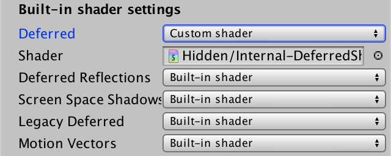

# 延迟光照

前面我们使用延迟渲染,渲染到了 4 个G-Buffer 纹理上, 然后使用 Unity 默认的延迟渲染帮我们着色

着色器名为 **Hidden Internal-DefferedShader** 

## 使用我们自己的延迟着色器

通过 **EditProject Settings/Graphics** 将 **Deferredshader** 切换到 Custom shader 然后使用我们自定义的 Shader




## 第二个 Pass 

当我们使用 LDR 相机时, unity 要求我们提供两个 Pass. 

禁用HDR后，灯光数据将会进行对数编码。最后的pass需要转换此编码

**避开天空盒**

在LDR模式下渲染时，你可能还会看到天空也变黑了. 我们需要使用模板在第二个 Pass 中设置模板遮罩

```cc
Pass 
{
    Cull Off
	ZTest Always
    ZWrite Off
        
	Stencil 
    {
      	Ref 	 	[_StencilNonBackground]  
		ReadMask 	[_StencilNonBackground]            
        CompBack 	Equal    
		CompFront   Equal          
    }   
}
```

**转换颜色**

为了使第二个pass工作正常，必须转换灯光缓冲区中的数据. 在 G-Buffer 阶段我们使用 exp2(-color) 来编码. 

所以我们需要使用 $-\log _2(C)$ 解码

```cc
struct VertexIn { 
    float4 vertex   : POSITION;
    float2 texcoord : TEXCOORD0;
};
struct VertexOut {
    float4 pos      : SV_POSITION;
    float2 texcoord : TEXCOORD0;
};

VertexOut vert (VertexIn vin) {
    VertexOut vout;
    vout.pos = UnityObjectToClipPos(vin.vertex);
    vout.texcoord = vin.texcoord;
    return vout;
}

sampler2D _LightBuffer;
float4 frag (VertexOut pin) : SV_Target {
    return -log2(tex2D(_LightBuffer, pin.texcoord));
}
```

## 2 方向光

