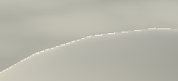

# 延迟光照

前面我们使用延迟渲染,渲染到了 4 个G-Buffer 纹理上, 然后使用 Unity 默认的延迟渲染帮我们着色

着色器名为 **Hidden Internal-DefferedShader** 

## 使用我们自己的延迟着色器

通过 **EditProject Settings/Graphics** 将 **Deferredshader** 切换到 Custom shader 然后使用我们自定义的 Shader


## 第二个 Pass 

当我们使用 LDR 相机时, unity 要求我们提供两个 Pass. 

禁用HDR后，灯光数据将会进行对数编码。最后的pass需要转换此编码

**避开天空盒**

在LDR模式下渲染时，你可能还会看到天空也变黑了. 我们需要使用模板在第二个 Pass 中设置模板遮罩

```cc
Pass 
{
    Cull Off
	ZTest Always
    ZWrite Off
        
	Stencil 
    {
      	Ref 	 	[_StencilNonBackground]  
		ReadMask 	[_StencilNonBackground]            
        CompBack 	Equal    
		CompFront   Equal          
    }   
}
```

**转换颜色**

为了使第二个pass工作正常，必须转换灯光缓冲区中的数据. 在 G-Buffer 阶段我们使用 exp2(-color) 来编码. 

所以我们需要使用 $-\log _2(C)$ 解码

```cc
struct VertexIn { 
    float4 vertex   : POSITION;
    float2 texcoord : TEXCOORD0;
};
struct VertexOut {
    float4 pos      : SV_POSITION;
    float2 texcoord : TEXCOORD0;
};

VertexOut vert (VertexIn vin) {
    VertexOut vout;
    vout.pos = UnityObjectToClipPos(vin.vertex);
    vout.texcoord = vin.texcoord;
    return vout;
}

sampler2D _LightBuffer;
float4 frag (VertexOut pin) : SV_Target {
    return -log2(tex2D(_LightBuffer, pin.texcoord));
}
```

## 方向光

因为我们需要为图像添加光照信息, 所以不能擦除已经渲染的图像. 通过更改混合模式为叠加

```cc
Blend One One
Cull Off
ZTest Always
ZWrite Off
```

同时我们需要所有灯光的着色器变态

```cc
#pragma exclude_renderers nomrt
#pragma multi_compile_lightpass			
#pragma multi_compile _ _ UNITY_HDR_ON
```

### G-Buffer UV 坐标

可以使用 **UnityCG.cginc** 中的 **ComputeScreenPos** 来计算, 同时需要在 片段中进行其次除法

```cc
struct VertexOut {
    float4 pos      : SV_Position;
    float4 texcoord : TEXCOORD0;
};

VertexOut vert(VertexIn vin) {
    VertexOut vout;
    vout.pos = UnityObjectToClipPos(vin.vertex);
    vout.texcoord = ComputeScreenPos(vin.pos);
    return vout;
}

float4 frag(VertexOut pin) : SV_Target {
    float2 texcoord = pin.texcoord.xy / pin.texcoord.w;
    //...
}
```

### 世界位置

创建延迟的雾效果时，我们必须找出片段与相机的距离。这个实现过程是通过从相机发射穿过每个片段到远平面的射线，然后按片段的深度值缩放这些光线

1. 将模型空间的法线作为射线传递到片段中

```cc
struct VertexIn {
    ...
	float3 normal : NORMAL;
};

struct VertexOut {
    float4 pos      : SV_Position;
    float4 texcoord : TEXCOORD0;
    float3 ray  	: TEXCOORD1;
};

VertexOut vert(VertexIn vin) {
	...
	vout.ray = vin.normal;        
}
```

2. 在片段中采样深度图获取线性深度

```cc
UNITY_DECLARE_DEPTH_TEXTURE(_CameraDepthTexture);			// 声明深度纹理

float4 frag(VertexOut pin) : SV_Target {
	float2 texcoord = pin.texcoord.xy / pin.texcoord.w;
    float depth = SAMPLE_DEPTH_TEXTURE(_CameraDepthTexture, texcoord);
    depth = Linear01Depth(depth);
}
```

3. 获取世界空间的位置

```cc
float3 oneDepthRay = pin.ray / pin.ray.z;							// 深度为 1 的射线. 
float3 viewPos = oneDepthRay * _ProjectionParames.z * depth;		// 乘上 线性深度 和 远平面 为 视图空间中的位置
float3 worldPos = mul(unity_CameraToWorld, float4(viewPos, 1.0));	// 乘上视图空间的逆矩阵还原到 时间空间
```

### 读取 G-Buffer 数据

```cc
sampler2D _CameraGBufferTexture0;
sampler2D _CameraGBufferTexture1;
sampler2D _CameraGBufferTexture2;

float4 frag(VertexOut pin) : SV_Target {
    float2 texcoord = pin.texcoord.xy / pin.texcoord.w;
    float3 albedo = tex2D(_CameraGBufferTexture0, texcoord).rgb;
    float3 fresnelR0 = tex2D(_CameraGBufferTexture1, texcoord).rgb;
    float smoothness = tex2D(_CameraGBufferTexture1, texcoord).a;
    float3 normal = tex2D(_CameraGBufferTexture2, texcoord).rgb * 2.0 - 1.0;
}
```

### 计算 BRDF

我们可以通过变量 **_LightColor** 和 **_LightDir** 获取方向光的颜色和方向.

然后使用 **UNITY_BRDF_PBS** 计算光照

```cc
float4 _LightColor;
float4 _LightDir;

UnityLight CreateLight() {
    UnityLight light;
    light.dir = -_LightDir.xyz;
    light.color = _LightColor.rgb;
    return light;
}

float4 frag(VertexOut pin) : SV_Target {
    float oneMinusReflectivity = 1 - SpecularStrength(fresnelR0);

    // ... 采样 G-Buffer
    float3 N = normal;
    float3 V = normalize(UnityWorldSpaceViewDir(pin.position));

    UnityLight light = CreateLight();
    UnityIndirect indirectLight;
    indirectLight.diffuse = 0;
    indirectLight.specular = 0;
    
    float4 color = UNITY_BRDF_PBS(albedo, fresnelR0, oneMinusReflectivity, smoothness, N, V, light, indirectLight);
    return color;
}
```

### 阴影

在前向渲染中我们使用, 我们依靠 **AutoLight** 中的宏来确定由阴影引起的光衰减.

该文件并没有考虑到延迟光照的情况, 因此我们需要自己进行阴影采样。通过 **_ShadowMapTexture** 变量可以访问阴影贴图

```cc
// 注意只能在方向光时定义, 在聚光灯下会报错
#if defined(DIRECTIONAL) || defined(DIRECTIONAL_COOKIE)
    sampler2D _ShadowMapTexture;
#endif

UnityLight CreateLight(float2 texcoord) {
    float shadowAttenuation = 1.0;
    #if defined(SHADOWS_SCREEN)			// 如果开启了阴影就使用阴影衰减
    	shadowAttenuation = tex2D(_ShadowMapTexture, texcoord).r;
    #endif
    
    UnityLight light;
    light.dir = -_LightDir.xyz;
    light.color = _LightColor.rgb * shadowAttenuation;
    return light;
}
```

### 淡入阴影

阴影贴图是有限的。它无法覆盖整个世界。它覆盖的面积越大，阴影的分辨率越低. Unity具有绘制阴影的最大距离。超出之后，就没有实时阴影了. 可以通过“Edit/ Project Settings / Quality”来调整此距离


使用 **UnityComputeShadowFadeDistance** 可以计算到渐隐的距离, 然后使用 **UnityComputeShadowFade** 计算合适的渐变因子, 在靠近深度图的边缘时, 会淡化阴影


```cc
sampler2D _ShadowMapTexture;

UnityLight CreateLight(float2 texcoord, float3 worldPos, float viewZ) {
    float shadowAttenuation = 1.0;
    #if defined(SHADOWS_SCREEN)			// 如果开启了阴影就使用阴影衰减
    	shadowAttenuation = tex2D(_ShadowMapTexture, texcoord).r;
    	float shadowFadeDistance = UnityComputeShadowFadeDistance(worldPos, viewZ);
    	float shadowFade = UnityComputeShadowFade(shadowFadeDistance);
    	shadowAttenuation = saturate(shadowAttenuation + shadowFade);
    #endif
    
    UnityLight light;
    light.dir = -_LightDir.xyz;
    light.color = _LightColor.rgb * shadowAttenuation;
    return light;
}
```

### 支持光 Cookies

新增 **uniform** 分别为 **sampler2D _LightTexture0** 和 **float4x4 unity_WorldToLight** 

在CreateLight中，使用矩阵将世界位置转换为灯光空间坐标。然后使用它们来采样cookie纹理

```cc
sampler2D _ShadowMapTexture;
sampler2D _LightTexture0;
float4x4 unity_WorldToLight;

UnityLight CreateLight(float2 texcoord, float3 worldPos, float viewZ) {
    float shadowAttenuation = 1.0;
    float lightAttenuation = 1.0;
    #if defined(SHADOWS_SCREEN)			// 如果开启了阴影就使用阴影衰减
    	shadowAttenuation = tex2D(_ShadowMapTexture, texcoord).r;
    	float shadowFadeDistance = UnityComputeShadowFadeDistance(worldPos, viewZ);
    	float shadowFade = UnityComputeShadowFade(shadowFadeDistance);
    	shadowAttenuation = saturate(shadowAttenuation + shadowFade);
    #endif
    
    #if defined(DIRECTIONAL_COOKIE)
    	float2 lightCookieTexcoord = mul(unity_WorldToLight, float4(worldPos, 1.0)).xy;
	    // lightAttenuation *= tex2Dbias(_LightTexture0, float4(lightCookieTexcoord, 0, -8)).w;
    	lightAttenuation *= tex2D(_LightTexture0, lightCookieTexcoord).w;
    #endif
    
    UnityLight light;
    light.dir = -_LightDir.xyz;
    light.color = _LightColor.rgb * (hadowAttenuation * lightAttenuation);
    return light;
}
```

**处理边缘失真**



Unity使用的解决方案是在对Mip贴图进行采样时施加偏差，因此我们也将这样做

```cc
lightAttenuation = tex2Dbias(_LightTexture0, float4(lightCookieTexcoord, 0, -8)).r;
```

### **支持LDR**

到目前为止，我们只能在HDR模式下正确渲染定向光。对于LDR，这是错误的


首先，必须将编码的LDR颜色乘以光缓冲区，而不是相加. 我们可以通过将着色器的混合模式 **_SrcBlend** 和 **_DstBlend**

```CC
Blend [_SrcBlend] [_DstBlend]
```

当未定义 **UNITY_HDR_ON** 时，我们还必须在片段程序的末尾应用 $2^{-C}$ 编码

```cc
#if !defined(UNITY_HDR_ON)
	color = exp2(-color);
#endif
```

## **聚光灯**

由于定向光会影响所有内容，因此它们将被绘制为全屏四边形。相反，聚光灯仅影响场景中位于其圆锥体内的部分。通常无需为整个图像计算聚光灯照明，取而代之的是绘制一个与聚光灯的影响**区域匹配的金字塔**

(我们的着色器只支持方向光, 得到错误的计算)


事实证明，金字塔被渲染为常规3D对象。它的背面被剔除，因此我们看到了金字塔的正面。而且只有当前面没有东西时才绘制它

这意味着我们的着色器的剔除和z测试设置。因此，将其从着色器中删除

```cc
- Cull Off
- ZTest Alwats    
```

### 支持聚光灯

当前，CreateLight仅适用于定向光源。让我们确保仅在适当的情况下使用特定于定向灯的代码

通过 **_LightPos** 可以访问到聚光灯的位置

```cc
float4 _LightPos;

UnityLight CreateLight(float2 texcoord, float3 worldPos, float viewZ) {
    float shadowAttenuation = 1.0;
    float lightAttenuation = 1.0;
    bool shadowed = false;
    UnityLight light;    
    
    #if defined(DIRECTIONAL) || defined(DIRECTIONAL_COOKIE)
        light.dir = -_LightDir.xyz;
        #if defined(DIRECTIONAL_COOKIE)		// 如果是 COOKIE
            float2 lightCookieTexcoord = mul(unity_WorldToLight, float4(worldPos, 1.0)).xy;
            // lightAttenuation *= tex2Dbias(_LightTexture0, float4(lightCookieTexcoord, 0, -8)).w;
            lightAttenuation *= tex2D(_LightTexture0, lightCookieTexcoord).w;
        #endif
        #if defined(SHADOWS_SCREEN)			// 如果开启了阴影就使用阴影衰减
    		shadowed = true;
            shadowAttenuation = tex2D(_ShadowMapTexture, texcoord).r;
	    #endif	
    // 如果是聚光灯
    #else	
    	float3 lightVec = _LightPos.xyz - worldPos;
    	light.dir = normalize(lightVec);
    #endif
    
   if (shadowed) {
        float shadowFadeDistance = UnityComputeShadowFadeDistance(worldPos, viewZ);
    	float shadowFade = UnityComputeShadowFade(shadowFadeDistance);
    	shadowAttenuation = saturate(shadowAttenuation + shadowFade);
   }

    light.color = _LightColor.rgb * (shadowAttenuation * lightAttenuation);
    return light;
}
```

### 聚光灯下计算正确的世界空间的位置

当我们使用方向光时, 使用的是 四边形 的法线作为射线, 这是正确的. 如果遇到聚光灯时, 使用顶点的法线作为射线是错误的.

**需要使用视图空间的顶点, 同时对 xy 取负(不明白)**, Unity 提供了 **float _LightAsQuad** 来判断是否是四边形

```cc
float _LightAsQuad;
VertexOut vert(VertexIn vin) {
    VertexOut vout;
    vout.pos = UnityObjectToClipPos(vin.vertex);
    vout.screenPos = ComputeScreenPos(vout.pos);
   	float3 viewPos = UnityObjectToViewPos(vin.vertex) * float3(-1, -1, 1);
    vout.ray = lerp(viewPos, vin.normal, _LightAsQuad);
    return vout;
}
```

### **Cookie衰减**

聚光灯的圆锥衰减是通过cookie纹理创建的. 聚光灯Cookie越远离你的灯光位置，它就会变得越大, 因为聚光灯的 **unity_WorldToLight** 是透视矩阵. 所以需要进行**齐次除法**

```cc
float4 lightCookieTexcoord = mul(unity_WorldToLight, float4(worldPos, 1.0));
lightCookieTexcoord.xy /= lightCookieTexcoord.w;
lightAttenuation *= tex2D(_LightTexture0, lightCookieTexcoord.xy).w;
```

这可能产生两个向前,向后两个圆锥. 向后的圆锥体通常会在渲染区域的外部,但这不是必然的.

因此，需要与一个负W坐标相对应的正向圆锥(右手坐标系, 看下-z)

```cc
lightAttenuation *= lightCookieTexcoord.w < 0;
```

### **距离衰减**

聚光灯发出的光也会根据距离而衰减。该衰减存储在查询纹理中，该纹理可通过 **_LightTextureB0** 采样获得.

同时使用 **UNITY_ATTEN_CHANNEL** 获取对应通道

```cc
sampler2D _LightTextureB0;

lightAttenuation *= tex2D(_LightTextureB0, (dot(lightVec, lightVec) * _LightPos.w).rr).UNITY_ATTEN_CHANNEL;
```

### 阴影

