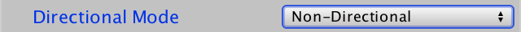

# **静态光照**

## 光贴图

执行照明计算非常昂贵。延迟渲染使我们可以使用很多灯光，但是阴影仍然是一个限制因素. 如果场景是动态的，那么我们将不可避免地执行这些计算。但是，如果光源和几何物体都不变，那么我们可以只计算一次光源并重复使用它

## **烘焙光**

在烘焙之前, 要先把光的 **Mode** 设置为 **Baked**

要启用 **LightMap** 需要在 **Lighting** 中的 **Mixed Lighting** 启用 **Baked Global Illumination**

然后在 **Lighting Mode** 设置为 **Baked Indirect**

## 静态物体

要想烘焙必须标记为静态物体, 被烘焙的灯可以不是静态的

检查器窗口右上方的 **Static** 切换

和实时光相比较, 烘焙光比较暗, 是因为只包含了漫反射光

## **光照贴图设置**

在 **Lighting** 窗口中, 有 **LightMap** 设置的部分. 在这里，你可以在质量，尺寸和烘焙时间之间进行权衡. 也可以在 Enlighten 灯光映射引擎和 Progressive 灯光映射器之间切换 后者以增量方式生成光照贴图，优先考虑场景视图中可见的内容，这在编辑时很方便

在执行其他任何操作之前，请将“Directional”设置为“Non-Direction”。稍后我们将讨论其他模式

可以在 Lighting 中的 Baked Lightmaps 中查看已经烘焙好的 光照贴图

## **间接光**

虽然烘焙光意味着我们失去了镜面光，但我们获得了间接光照. 

间接光的特殊设置是环境光遮挡

## **透明度**

光照贴图可以处理半透明的表面，光线会穿过透明物体

